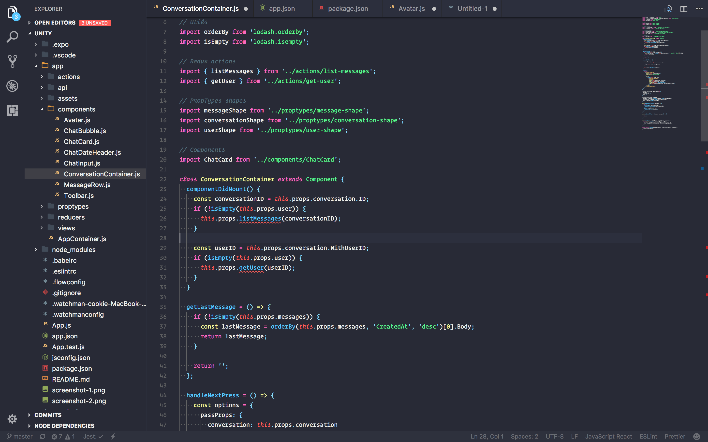
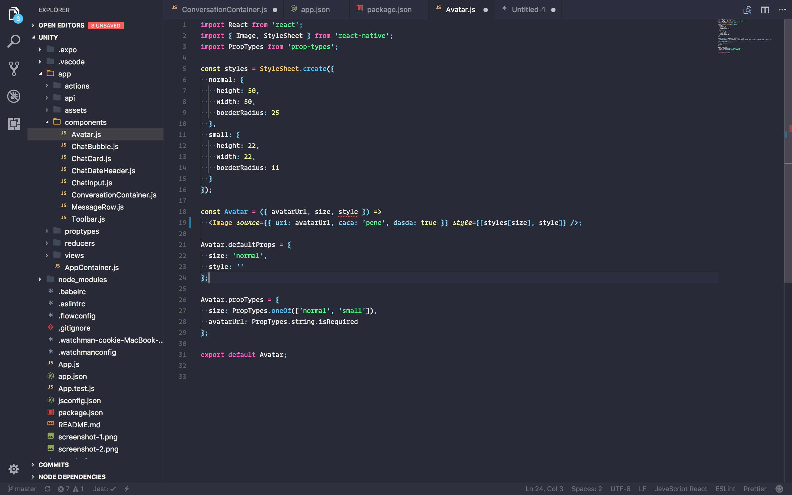

# VS Code Snazzy Theme

> VS Code theme based on hyper-snazzy with bright colors

   

## About

Visual Studio Code theme based on hyper-snazzy colors from [Sindre Sorhus](https://github.com/sindresorhus).

## Install

This theme is available for free in the [Visual Studio Code Marketplace](https://marketplace.visualstudio.com/items/xdae.snazzy-vs-theme).

It can be installed by typing `⌘P` and running `ext install vscode-snazzy` or by typing `⇧⌘X` and selecting it in the extensions search.

## Related

- [VS Code](https://github.com/Microsoft/vscode) - Editor
- [hyper-snazzy](https://github.com/sindresorhus/hyper-snazzy) - Colors
- [Alexander Bast](https://github.com/alexanderbast) - inspiration

**Enjoy!**
